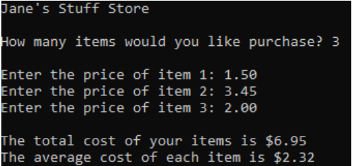

## Jane's Stuff Store

### Instructions:
 
- Jane’s Stuff Store sells a variable number of items to every customer. Recently Jane’s customers have been requesting a printout showing the average cost of each item purchased and the total cost of all items purchased. Create a program that asks the user how many items they wish to purchase.  The program should then use a loop to prompt the user for the price of each item and to calculate the total cost of all items. The program should calculate the average cost of each item purchased. The program should print out the total cost for all items as well as the average cost of each item purchased.
- Enter your name, the lab number, and the current date into a set of comments at the top of the code.     
- Push the program source code to the assignment repo. 

### Example Output

### Grading:
General, compiles, comments, proper indentation, etc   
Input  
Output  
Calculates total using an accumulator  
Calculates Average
